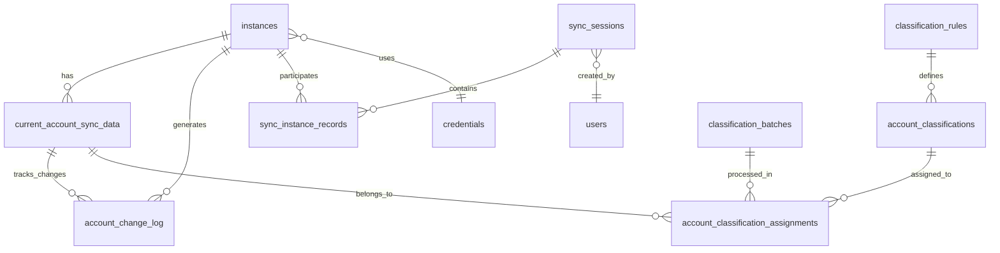

# 鲸落 - 数据库表结构总结

> **文档版本**: v4.0.1  
> **更新时间**: 2025年9月17日  
> **数据库类型**: PostgreSQL 15

## 📊 表结构概览

当前数据库包含 **20个表**，主要分为以下几个功能模块：

### 🔐 **核心业务表**
- `instances` - 数据库实例管理
- `credentials` - 数据库凭据管理
- `current_account_sync_data` - 账户当前状态同步数据
- `account_change_log` - 账户变更日志

### 📋 **同步管理表**
- `sync_sessions` - 同步会话管理
- `sync_instance_records` - 同步实例记录
- `sync_sessions_backup` - 同步会话备份

### 🏷️ **分类管理表**
- `account_classifications` - 账户分类
- `account_classification_assignments` - 账户分类分配
- `classification_batches` - 分类批次
- `classification_rules` - 分类规则

### ⚙️ **配置管理表**
- `database_type_configs` - 数据库类型配置
- `permission_configs` - 权限配置
- `global_params` - 全局参数

### 📝 **日志和任务表**
- `unified_logs` - 统一日志
- `logs` - 系统日志
- `tasks` - 任务管理
- `apscheduler_jobs` - 定时任务

### 🔧 **系统表**
- `users` - 用户管理
- `alembic_version` - 数据库迁移版本

---

## 🗂️ 详细表结构

### 1. **instances** - 数据库实例表

| 字段名 | 类型 | 约束 | 说明 |
|--------|------|------|------|
| `id` | INTEGER | PRIMARY KEY | 主键 |
| `name` | VARCHAR(255) | UNIQUE, NOT NULL | 实例名称 |
| `db_type` | VARCHAR(50) | NOT NULL, INDEX | 数据库类型 |
| `host` | VARCHAR(255) | NOT NULL | 主机地址 |
| `port` | INTEGER | NOT NULL | 端口号 |
| `database_name` | VARCHAR(255) | NULL | 数据库名称 |
| `database_version` | VARCHAR(100) | NULL | 原始版本字符串 |
| `main_version` | VARCHAR(20) | NULL | 主版本号 |
| `detailed_version` | VARCHAR(50) | NULL | 详细版本号 |
| `environment` | VARCHAR(20) | NOT NULL, DEFAULT 'production' | 环境类型 |
| `sync_count` | INTEGER | NOT NULL, DEFAULT 0 | 同步次数 |
| `credential_id` | INTEGER | FOREIGN KEY | 凭据ID |
| `description` | TEXT | NULL | 描述 |
| `tags` | JSON | NULL | 标签 |
| `status` | VARCHAR(20) | DEFAULT 'active' | 状态 |
| `is_active` | BOOLEAN | NOT NULL, DEFAULT TRUE | 是否活跃 |
| `last_connected` | TIMESTAMP WITH TIME ZONE | NULL | 最后连接时间 |
| `created_at` | TIMESTAMP WITH TIME ZONE | DEFAULT now() | 创建时间 |
| `updated_at` | TIMESTAMP WITH TIME ZONE | DEFAULT now() | 更新时间 |
| `deleted_at` | TIMESTAMP WITH TIME ZONE | NULL | 删除时间 |

**索引**:
- `idx_name` (name)
- `idx_dbtype` (db_type)
- `idx_environment` (environment)
- `idx_status` (status)

---

### 2. **current_account_sync_data** - 账户当前状态同步数据表

| 字段名 | 类型 | 约束 | 说明 |
|--------|------|------|------|
| `id` | INTEGER | PRIMARY KEY | 主键 |
| `instance_id` | INTEGER | FOREIGN KEY, NOT NULL | 实例ID |
| `db_type` | VARCHAR(20) | NOT NULL | 数据库类型 |
| `session_id` | VARCHAR(36) | NULL | 会话ID |
| `sync_time` | TIMESTAMP WITH TIME ZONE | DEFAULT now() | 同步时间 |
| `status` | VARCHAR(20) | DEFAULT 'success' | 状态 |
| `message` | TEXT | NULL | 消息 |
| `error_message` | TEXT | NULL | 错误消息 |
| `username` | VARCHAR(255) | NOT NULL | 用户名 |
| `is_superuser` | BOOLEAN | DEFAULT FALSE | 是否超级用户 |

#### **MySQL权限字段**
| 字段名 | 类型 | 说明 |
|--------|------|------|
| `global_privileges` | JSON | MySQL全局权限 |
| `database_privileges` | JSON | MySQL数据库权限 |

#### **PostgreSQL权限字段**
| 字段名 | 类型 | 说明 |
|--------|------|------|
| `predefined_roles` | JSON | PostgreSQL预定义角色 |
| `role_attributes` | JSON | PostgreSQL角色属性 |
| `database_privileges_pg` | JSON | PostgreSQL数据库权限 |
| `tablespace_privileges` | JSON | PostgreSQL表空间权限 |

#### **SQL Server权限字段**
| 字段名 | 类型 | 说明 |
|--------|------|------|
| `server_roles` | JSON | SQL Server服务器角色 |
| `server_permissions` | JSON | SQL Server服务器权限 |
| `database_roles` | JSON | SQL Server数据库角色 |
| `database_permissions` | JSON | SQL Server数据库权限 |

#### **Oracle权限字段**
| 字段名 | 类型 | 说明 |
|--------|------|------|
| `oracle_roles` | JSON | Oracle角色 |
| `system_privileges` | JSON | Oracle系统权限 |
| `tablespace_privileges_oracle` | JSON | Oracle表空间权限 |

#### **通用字段**
| 字段名 | 类型 | 说明 |
|--------|------|------|
| `type_specific` | JSON | 其他类型特定字段 |
| `last_sync_time` | TIMESTAMP WITH TIME ZONE | 最后同步时间 |
| `last_change_type` | VARCHAR(20) | 最后变更类型 |
| `last_change_time` | TIMESTAMP WITH TIME ZONE | 最后变更时间 |
| `is_deleted` | BOOLEAN | 是否删除 |
| `deleted_time` | TIMESTAMP WITH TIME ZONE | 删除时间 |

**约束**:
- `uq_current_account_sync` (instance_id, db_type, username)

**索引**:
- `idx_instance_dbtype` (instance_id, db_type)
- `idx_deleted` (is_deleted)
- `idx_username` (username)

---

### 3. **account_change_log** - 账户变更日志表

| 字段名 | 类型 | 约束 | 说明 |
|--------|------|------|------|
| `id` | INTEGER | PRIMARY KEY | 主键 |
| `instance_id` | INTEGER | FOREIGN KEY, NOT NULL | 实例ID |
| `db_type` | VARCHAR(20) | NOT NULL | 数据库类型 |
| `username` | VARCHAR(255) | NOT NULL | 用户名 |
| `change_type` | VARCHAR(50) | NOT NULL | 变更类型 |
| `change_time` | TIMESTAMP WITH TIME ZONE | DEFAULT now() | 变更时间 |
| `session_id` | VARCHAR(36) | NULL | 会话ID |
| `status` | VARCHAR(20) | DEFAULT 'success' | 状态 |
| `message` | TEXT | NULL | 消息 |
| `privilege_diff` | JSON | NULL | 权限变更差异 |
| `other_diff` | JSON | NULL | 其他字段变更差异 |

**索引**:
- `idx_instance_dbtype_username_time` (instance_id, db_type, username, change_time)
- `idx_change_type_time` (change_type, change_time)
- `idx_username_time` (username, change_time)

---

### 4. **sync_sessions** - 同步会话表

| 字段名 | 类型 | 约束 | 说明 |
|--------|------|------|------|
| `id` | INTEGER | PRIMARY KEY | 主键 |
| `session_id` | VARCHAR(36) | UNIQUE, NOT NULL | 会话ID |
| `sync_type` | VARCHAR(50) | NOT NULL | 同步类型 |
| `sync_category` | VARCHAR(50) | NOT NULL | 同步分类 |
| `created_by` | INTEGER | FOREIGN KEY | 创建者ID |
| `status` | VARCHAR(20) | DEFAULT 'pending' | 状态 |
| `total_instances` | INTEGER | DEFAULT 0 | 总实例数 |
| `successful_instances` | INTEGER | DEFAULT 0 | 成功实例数 |
| `failed_instances` | INTEGER | DEFAULT 0 | 失败实例数 |
| `started_at` | TIMESTAMP WITH TIME ZONE | NULL | 开始时间 |
| `completed_at` | TIMESTAMP WITH TIME ZONE | NULL | 完成时间 |
| `created_at` | TIMESTAMP WITH TIME ZONE | DEFAULT now() | 创建时间 |
| `error_message` | TEXT | NULL | 错误消息 |

---

### 5. **sync_instance_records** - 同步实例记录表

| 字段名 | 类型 | 约束 | 说明 |
|--------|------|------|------|
| `id` | INTEGER | PRIMARY KEY | 主键 |
| `session_id` | VARCHAR(36) | FOREIGN KEY, NOT NULL | 会话ID |
| `instance_id` | INTEGER | FOREIGN KEY, NOT NULL | 实例ID |
| `status` | VARCHAR(20) | DEFAULT 'pending' | 状态 |
| `started_at` | TIMESTAMP WITH TIME ZONE | NULL | 开始时间 |
| `completed_at` | TIMESTAMP WITH TIME ZONE | NULL | 完成时间 |
| `accounts_synced` | INTEGER | DEFAULT 0 | 同步账户数 |
| `accounts_created` | INTEGER | DEFAULT 0 | 创建账户数 |
| `accounts_updated` | INTEGER | DEFAULT 0 | 更新账户数 |
| `accounts_deleted` | INTEGER | DEFAULT 0 | 删除账户数 |
| `error_message` | TEXT | NULL | 错误消息 |
| `sync_details` | JSON | NULL | 同步详情 |

---

### 6. **credentials** - 凭据表

| 字段名 | 类型 | 约束 | 说明 |
|--------|------|------|------|
| `id` | INTEGER | PRIMARY KEY | 主键 |
| `name` | VARCHAR(255) | NOT NULL | 凭据名称 |
| `username` | VARCHAR(255) | NOT NULL | 用户名 |
| `password` | VARCHAR(255) | NOT NULL | 密码（加密） |
| `credential_type` | VARCHAR(50) | NOT NULL | 凭据类型 |
| `description` | TEXT | NULL | 描述 |
| `created_at` | TIMESTAMP WITH TIME ZONE | DEFAULT now() | 创建时间 |
| `updated_at` | TIMESTAMP WITH TIME ZONE | DEFAULT now() | 更新时间 |

---

### 7. **users** - 用户表

| 字段名 | 类型 | 约束 | 说明 |
|--------|------|------|------|
| `id` | INTEGER | PRIMARY KEY | 主键 |
| `username` | VARCHAR(255) | UNIQUE, NOT NULL | 用户名 |
| `password_hash` | VARCHAR(255) | NOT NULL | 密码哈希 |
| `role` | VARCHAR(50) | NOT NULL | 角色 |
| `is_active` | BOOLEAN | DEFAULT TRUE | 是否活跃 |
| `last_login` | TIMESTAMP WITH TIME ZONE | NULL | 最后登录时间 |
| `created_at` | TIMESTAMP WITH TIME ZONE | DEFAULT now() | 创建时间 |
| `updated_at` | TIMESTAMP WITH TIME ZONE | DEFAULT now() | 更新时间 |

---

## 🔗 表关系图

---

## 📈 数据存储特点

### **JSON字段使用**
- 大量使用JSON字段存储复杂权限结构
- 支持不同数据库类型的权限格式
- 便于扩展和维护

### **时间戳管理**
- 统一使用 `TIMESTAMP WITH TIME ZONE`
- 支持时区感知
- 自动更新机制

### **软删除支持**
- 关键表支持软删除
- 保留历史数据
- 支持数据恢复

### **索引优化**
- 复合索引优化查询性能
- 外键索引保证关联查询效率
- 状态字段索引支持过滤查询

---

## 🚀 性能建议

### **查询优化**
1. 使用复合索引进行多条件查询
2. JSON字段查询使用GIN索引
3. 时间范围查询使用时间戳索引

### **数据维护**
1. 定期清理过期的变更日志
2. 归档历史同步会话数据
3. 监控JSON字段大小

### **扩展性**
1. 表结构支持水平扩展
2. JSON字段便于添加新字段
3. 模块化设计支持功能扩展

---

**总结**: 当前数据库设计充分考虑了多数据库类型支持、权限管理复杂性、同步过程追踪等核心需求，通过合理的表结构设计和索引优化，为系统的高效运行提供了坚实基础。
