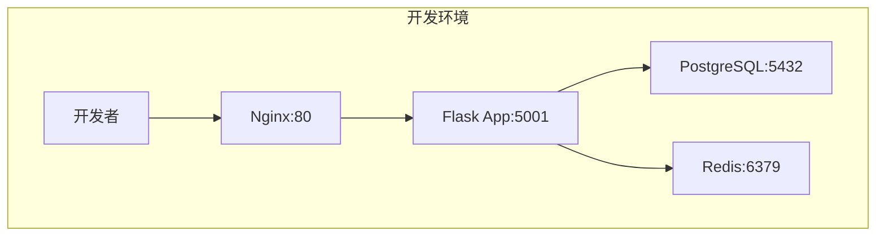
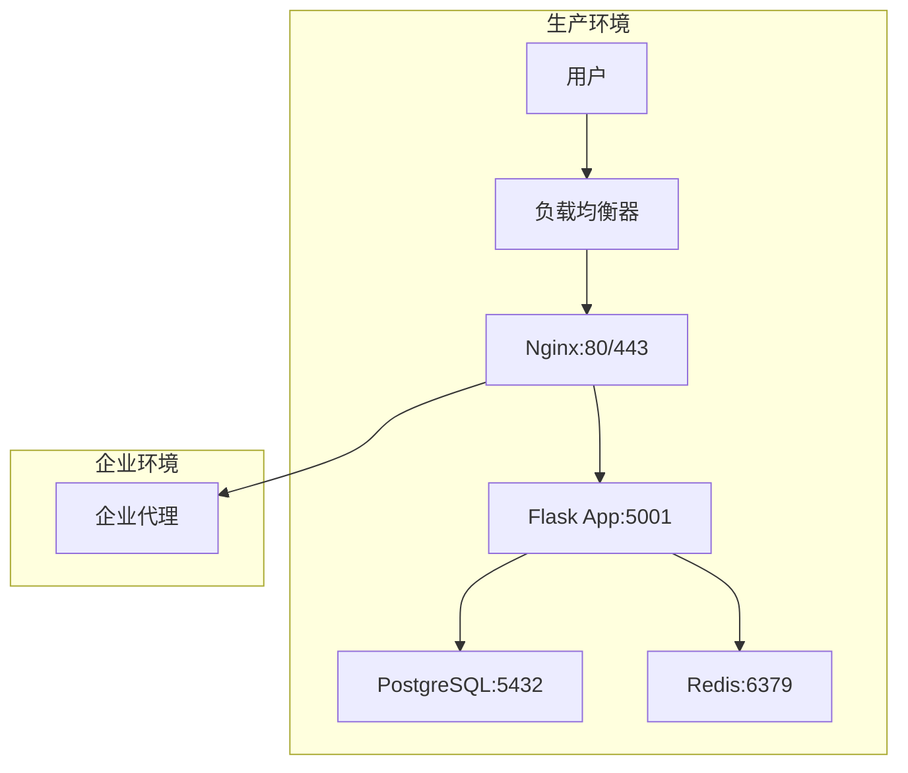

# 🐟 鲸落项目部署文档中心

## 📋 文档概述

本目录包含鲸落项目的完整部署文档，涵盖开发环境、生产环境的配置、部署、运维等各个方面。

## 📚 文档结构

### 🚀 部署指南

| 文档 | 描述 | 适用环境 | 状态 |
|------|------|----------|------|
| [生产环境部署指南](./PRODUCTION_DEPLOYMENT_GUIDE.md) | 详细的生产环境部署配置和运维指南 | 生产环境 | ✅ 完成 |
| [开发环境部署指南](../guides/DEVELOPMENT_SETUP.md) | 开发环境快速搭建指南 | 开发环境 | ✅ 完成 |

### 🔄 配置对比

| 文档 | 描述 | 内容 |
|------|------|------|
| [开发vs生产环境对比](./DEV_VS_PROD_COMPARISON.md) | 详细对比开发和生产环境的配置差异 | 架构、Docker、Nginx、应用配置等 |

### 🔍 验证报告

| 文档 | 描述 | 验证范围 |
|------|------|----------|
| [生产环境配置验证报告](./PRODUCTION_CONFIG_VALIDATION.md) | 生产环境所有配置文件的验证结果 | Docker、Nginx、应用、脚本等 |

## 🏗️ 架构概览

### 开发环境架构



### 生产环境架构



## 🚀 快速开始

### 开发环境

```bash
# 1. 克隆项目
git clone https://github.com/your-org/TaifishingV4.git
cd TaifishingV4

# 2. 配置环境变量
cp env.example .env
# 编辑.env文件

# 3. 启动开发环境
make dev start

# 4. 访问应用
open http://localhost
```

### 生产环境

```bash
# 1. 配置生产环境
cp env.production .env
# 编辑.env文件，设置生产配置

# 2. 部署生产环境
make prod deploy

# 3. 验证部署
make prod health

# 4. 访问应用
open http://localhost
```

## 🔧 配置说明

### 环境变量

| 环境 | 配置文件 | 说明 |
|------|----------|------|
| 开发环境 | `env.example` | 开发环境配置模板 |
| 生产环境 | `env.production` | 生产环境配置模板 |

### Docker配置

| 环境 | Docker Compose | Dockerfile | 说明 |
|------|----------------|------------|------|
| 开发环境 | `docker-compose.dev.yml` | `Dockerfile.dev` | 开发环境配置 |
| 生产环境 | `docker-compose.prod.yml` | `Dockerfile.prod` | 生产环境配置 |

### Nginx配置

| 环境 | 站点配置 | 说明 |
|------|----------|------|
| 开发环境 | `nginx/sites-available/whalefall-dev` | 开发环境Nginx配置 |
| 生产环境 | `nginx/sites-available/whalefall-prod` | 生产环境Nginx配置 |

## 📊 服务组件

### 核心服务

| 服务 | 版本 | 端口 | 功能 |
|------|------|------|------|
| Nginx | 1.18+ | 80, 443 | 反向代理、静态文件服务 |
| Flask | 3.0.3 | 5001 | Web应用服务 |
| Gunicorn | 生产级 | - | WSGI服务器 |
| PostgreSQL | 15-alpine | 5432 | 主数据库 |
| Redis | 7-alpine | 6379 | 缓存和会话存储 |
| Supervisor | - | - | 进程管理 |

### 支持服务

| 服务 | 功能 | 说明 |
|------|------|------|
| Oracle Instant Client | Oracle数据库支持 | 支持Oracle数据库连接 |
| APScheduler | 定时任务 | 替代Celery的轻量级调度器 |

## 🛠️ 运维命令

### 开发环境

```bash
# 环境管理
make dev start      # 启动开发环境
make dev stop       # 停止开发环境
make dev restart    # 重启开发环境
make dev status     # 查看服务状态

# 日志管理
make dev logs       # 查看所有日志
make dev logs-app   # 查看应用日志
make dev logs-db    # 查看数据库日志
make dev logs-redis # 查看Redis日志

# 开发工具
make dev shell      # 进入应用容器
make dev health     # 健康检查
make dev test       # 运行测试
```

### 生产环境

```bash
# 部署管理
make prod deploy    # 部署生产环境
make prod start     # 启动生产环境
make prod stop      # 停止生产环境
make prod restart   # 重启生产环境
make prod status    # 查看服务状态

# 日志管理
make prod logs      # 查看所有日志
make prod logs-app  # 查看应用日志
make prod logs-db   # 查看数据库日志
make prod logs-redis # 查看Redis日志

# 运维工具
make prod shell     # 进入应用容器
make prod health    # 健康检查
make prod backup    # 备份数据
make prod restore   # 恢复数据
```

## 🔒 安全配置

### 网络安全

- 使用防火墙限制端口访问
- 配置HTTPS证书（推荐）
- 设置适当的CORS策略

### 应用安全

- 使用强密码和密钥
- 定期更新依赖包
- 启用日志审计

### 数据安全

- 数据库连接加密
- 敏感数据加密存储
- 定期备份数据

## 📈 监控和运维

### 健康检查

```bash
# 应用健康检查
curl -f http://localhost/health

# 数据库健康检查
docker-compose exec postgres pg_isready -U whalefall_user -d whalefall_prod

# Redis健康检查
docker-compose exec redis redis-cli ping
```

### 日志管理

| 服务 | 日志文件 | 说明 |
|------|----------|------|
| Nginx | `/var/log/nginx/whalefall_access.log` | 访问日志 |
| Nginx | `/var/log/nginx/whalefall_error.log` | 错误日志 |
| Flask | `/app/userdata/logs/whalefall.log` | 应用日志 |
| Gunicorn | `/app/userdata/logs/gunicorn_access.log` | Gunicorn访问日志 |

### 性能监控

| 指标 | 阈值 | 说明 |
|------|------|------|
| CPU使用率 | < 80% | 避免过载 |
| 内存使用率 | < 85% | 防止OOM |
| 磁盘使用率 | < 90% | 避免空间不足 |
| 响应时间 | < 2s | 用户体验 |
| 错误率 | < 1% | 系统稳定性 |

## 🛠️ 故障排除

### 常见问题

1. **容器启动失败**
   - 检查容器日志: `docker logs container_name`
   - 检查Nginx配置: `docker exec container_name nginx -t`
   - 检查环境变量: `docker exec container_name env`

2. **数据库连接失败**
   - 检查数据库状态: `docker-compose exec postgres pg_isready`
   - 检查网络连接: `docker network ls`
   - 检查环境变量: `echo $DATABASE_URL`

3. **应用无法访问**
   - 检查端口映射: `docker port container_name`
   - 检查防火墙: `sudo ufw status`
   - 检查Nginx状态: `docker exec container_name nginx -s reload`

### 性能优化

1. **数据库优化**
   - 创建适当的索引
   - 优化查询语句
   - 配置连接池

2. **应用优化**
   - 启用Redis缓存
   - 优化静态文件服务
   - 配置Gunicorn工作进程

## 📚 参考资源

### 官方文档

- [Docker官方文档](https://docs.docker.com/)
- [Docker Compose文档](https://docs.docker.com/compose/)
- [Nginx配置指南](https://nginx.org/en/docs/)
- [Gunicorn配置](https://docs.gunicorn.org/en/stable/configure.html)
- [PostgreSQL文档](https://www.postgresql.org/docs/)
- [Redis文档](https://redis.io/documentation)

### 项目文档

- [项目架构文档](../architecture/spec.md)
- [API文档](../api/README.md)
- [开发指南](../guides/README.md)
- [数据库文档](../database/README.md)

## 🤝 贡献指南

如果您发现文档中的问题或有改进建议，请：

1. 创建Issue描述问题
2. 提交Pull Request修复问题
3. 更新相关文档

## 📝 更新日志

| 版本 | 日期 | 更新内容 |
|------|------|----------|
| 1.0.0 | 2024-09-20 | 初始版本，包含完整的部署文档 |

---

**注意**: 本文档会随着项目发展持续更新，请定期查看最新版本。
